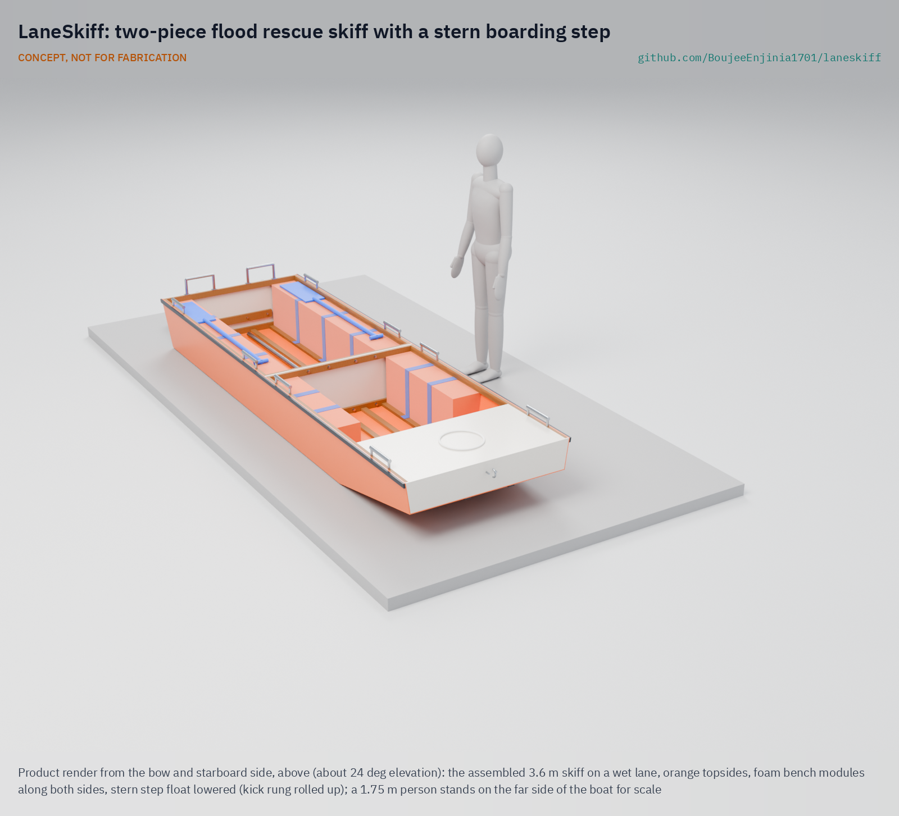

# LaneSkiff

     

**Area:** Situational field hardware · **TRL:** 3 of 9 (proof of concept on paper) · **Value-engineering target:** USD 1,500 (estimated cost of the constructable design USD 1,961) · **Difficulty:** 3 of 5

A flat-bottomed flood rescue boat two people carry into flooded lanes, with a floating stern step so people can climb in from waist-deep water.

> CONCEPT, NOT FOR FABRICATION. LaneSkiff is a TRL 3 design on paper: it has not been built or tested, and it is not certified rescue equipment.

## Concept rationale

Flood rescue in lanes is slow and awkward for boats built for open water. Hard boats are heavy to carry in, tip when someone climbs over the side, and sit too high for a person standing in waist-deep water. LaneSkiff is a flat-bottomed skiff sized for lanes: two people carry it in, and a crew pushes it along with a pole or paddles. A floating step at the stern centre lets people climb aboard over the end, where the boat is least likely to heel, and built-in buoyancy keeps it level and afloat even when it is swamped.

The hull splits into two rigid halves that bolt together, so it travels in a small vehicle and each half can be carried by one or two people. A material substitution table gives build paths in plywood and epoxy, aluminium sheet and plastic sheet, so local boatbuilders can make it with what they have. A fixed, forward-only fin drive is an optional add-on for longer transits; the core boat needs no engine. Payload is set at a realistic 5 to 8 times hull mass for a rigid hull.

## Burning platform

About 1.81 billion people, 23% of the world's population, are directly exposed to 1-in-100-year floods, and 89% of them live in low and middle income countries; India alone accounts for about 390 million ([Rentschler et al., Nature Communications, 2022](https://www.nature.com/articles/s41467-022-30727-4)). Drowning accounts for 75% of deaths in flood disasters ([WHO](https://www.who.int/health-topics/floods/drowning---key-facts)). In the 2018 Kerala floods about 800,000 people were displaced and many were stranded while rescuers worked with hundreds of boats ([CBS News, 2018](https://www.cbsnews.com/news/kerala-historic-floods-india-rescue-efforts-continue-hundreds-killed-2018-08-19/)).

The boats that exist are either costly, heavy or hard to board. A purpose-built inflatable rescue craft such as the Oceanid RDC costs USD 4,900 ([Oceanid](https://oceanid.com/RDC-Pricing-Specifications.html)). A 12 ft aluminium jon boat such as the Lund 1240 starts at USD 1,694 and weighs 107 lb (49 kg), but is rated for two people ([Lund](https://www.lundboats.com/families/jon-boat/1240.html)). Larger flood skiffs carry eight but weigh about 245 kg ([MetalBoatKits](https://metalboatkits.com/product/19-foot-6m-flood-rescue-skiff-new/)), too much to carry into a lane. None of them gives a person in waist-deep water a stable way in.

## Where it could be used

### By industry

| Industry | Use |
| --- | --- |
| Disaster response and civil defence | Lane-level evacuation where large boats cannot enter |
| Community and volunteer rescue groups | A boat local fishers and volunteers can build, store and carry to the flood |
| Humanitarian agencies | Prepositioned kits and local build programmes in flood-prone districts |
| Municipal services | Moving people, medicine and supplies through flooded streets |
| Small-scale fishing and boatbuilding | A design local boatyards can make and sell before the monsoon |
| Healthcare | Evacuating patients with limited mobility from flooded homes |

### By country or region

| Country or region | Why it matters there |
| --- | --- |
| India (Kerala) | The 2018 floods displaced about 800,000 people, with rescuers using hundreds of boats and nearly two dozen helicopters ([CBS News, 2018](https://www.cbsnews.com/news/kerala-historic-floods-india-rescue-efforts-continue-hundreds-killed-2018-08-19/)). |
| India (Bihar) | Villagers buy their own boats each flood season; small boats cost Rs 30,000 to 50,000 ([Gulf News, 2020](https://gulfnews.com/world/asia/india/india-floods-boost-boat-making-businesses-in-bihar-1.73026964)), so a cheaper, lighter local design matters. |
| Bangladesh | The August 2024 eastern floods affected 5.6 million people, with more than 500,000 seeking shelter as water submerged homes and streets ([UNICEF, 2024](https://www.unicef.org/press-releases/two-million-children-risk-worst-floods-three-decades-lash-through-eastern-bangladesh)). |
| Pakistan | The 2022 floods affected 33 million people and displaced 500,000 into relief camps ([UN News, 2022](https://news.un.org/en/story/2022/08/1125752)). |
| United States | In Hurricane Harvey, volunteer groups such as the Cajun Navy rescued people with jon boats, fishing boats, row boats, canoes and kayaks ([NBC News, 2017](https://www.nbcnews.com/storyline/hurricane-harvey/triumph-struggle-ragtag-cajun-navy-responds-houston-flood-n796991)), showing how much flood rescue relies on small craft. |

## What sparked the idea

During the Kerala floods of August 2018, Jaisal, a 32-year-old fisherman from Tanur in Malappuram, volunteered with a rescue team. Flat-bottomed boats are unstable and hard to board from the water, so he knelt in the floodwater and let women step on his back to climb in ([The Week, 2018](https://www.theweek.in/news/india/2018/08/20/kerala-fisherman-turns-stepping-stone-to-safety-literally.html)). His team rescued 17 families. LaneSkiff asks what boat would have made that sacrifice unnecessary: one with its own stable step, light enough to carry into the lanes where he worked.

## Problem

In urban and village floods, rescuers need a light boat they can carry into narrow flooded lanes, and people standing in waist-deep water need a way to climb into it without a rescuer kneeling as a step.

Full problem statement: [docs/01-problem.md](docs/01-problem.md)

## Concept

LaneSkiff is a flat-bottomed boat that two people carry into flooded lanes and push along with a pole or paddle. People in waist-deep water climb in using a floating step at the back, and it stays level and afloat even when swamped.

The constructable design is a 3.6 m punt-form skiff, 1.197 m wide over its rub strakes, stitched and glued from flat okoume plywood with softwood framing in two closed halves of 1.8 m that bolt together with eight M10 bolts and one spanner. Covered foam modules along both sides, two in the stern quarters and a foam bow box keep it nearly level when swamped (161 mm of freeboard at the transom). It is rated for five persons and draws 148 mm with them aboard. On paper, a person boarding over the stern step heels it 3.3 degrees, against 12.8 degrees over the side. The hull weighs 87.9 kg as drawn, still well over the 50 kg carry target, so each half is carried by two people with shoulder slings; see the [review note](docs/REVIEW.md).

Full design precis: [docs/02-concept.md](docs/02-concept.md) · Requirements: [docs/03-requirements.md](docs/03-requirements.md) · Calculations: [docs/04-calcs/01-sizing.md](docs/04-calcs/01-sizing.md) · Prototype build plan: [docs/05-build-plan.md](docs/05-build-plan.md) · Design decisions: [docs/06-design-decisions.md](docs/06-design-decisions.md)

## Key components

- Flat-bottom hull in two closed halves of okoume plywood and epoxy (6 mm bottom, 4 mm sides), each with its own bulkhead and softwood ring frame
- Eight M10 joint bolts into welded nut plates, two alignment pins
- Level flotation (LevelHull layout): covered foam bench modules along both sides and a foam bow box
- Stern-centre floating boarding step on strap hinges, with stop straps, a kick rung and two transom grab handles
- Eight carry handles and two padded shoulder slings
- Two-section push pole, two paddles, bow eye and bow line
- HDPE rub strakes and bottom skids
- Material substitution table: plywood and epoxy, aluminium sheet, HDPE sheet
- Optional fixed forward-only fin drive: not in the first prototype design (open decision)

## Building the prototype

The [prototype build plan](docs/05-build-plan.md) (LSK-BLD-001, plan, not yet built) shows a small boatyard how to build the first LaneSkiff component by component, with making sketches for fifteen made parts, close-ups of nine joints and a picture for each of seventeen assembly steps. The halves are stitched and glued from flat plywood panels, framed with softwood and glassed outside; the foam modules are cut with a knife and sewn into covers; the step is a glued float on strap hinges. No one is carried before the step, straps, handles and joint are proof-loaded and the boat passes load and swamp trials in calm, shallow water with a safety boat, which is TRL 4 work.

## Safety

> Published as an open engineering reference, not a certified rescue boat.
>
> Crew and passengers wear life jackets at all times; crews need water rescue training under their own agency's rules.
>
> Not for swiftwater, surf, open water or water flowing faster than a person can wade against.
>
> Do not exceed the rated load for the build material; the payload differs between build paths.
>
> Watch for submerged hazards, open drains, live electrical wires and contaminated water.
>
> The boarding step swings on a hinge: a 40 mm gap keeps fingers and feet clear through its swing, and it is proof-loaded before any boarding trial.
>
> When swamped, people stay seated and low; two people moving to one side can dip the gunwale.
>
> This design is published as an open engineering reference. It is not certified equipment.

## Repository layout

| Folder | Contents |
| --- | --- |
| `docs/` | Problem, concept, requirements, calculations, build plan and design decisions |
| `cad/src/` | build123d Python source, the source of truth for all geometry |
| `cad/step/`, `cad/stl/` | Exported models for FreeCAD, other CAD tools and printing |
| `cad/drawings/` | 2D sketches and dimensioned drawings |
| `bom/` | Bill of materials |
| `electronics/` | KiCad schematics and PCB layouts |
| `firmware/` | Microcontroller code |
| `media/` | Renders, perspectives and photos |
| `build-log/` | Dated prototyping notes |

## Documentation

Controlled documents follow the portfolio [documentation standard](.kit/STANDARDS.md). Each carries a document ID (LSK-PRC-001 for the precis), a version and a revision history. Branded PDFs are built with `python .kit/render.py` and attached to GitHub Releases when a document is tagged, for example `LSK-PRC-001/v1.0`.

## Credits

Designed by Amish Chadha at Design Molecule Labs. See [CONTRIBUTORS.md](CONTRIBUTORS.md) for roles. To cite this design, use [CITATION.cff](CITATION.cff) (GitHub shows it as "Cite this repository").

AI assistance (Claude) was used to accelerate prototype documentation and first-pass research. Design direction and all decisions are Amish Chadha's, recorded in this repository's decision records (`docs/decisions/`).

## Licenses

- **Hardware** (CAD, drawings, BOM, electronics): [CERN-OHL-S v2](LICENSE)
- **Software** (firmware, scripts, notebooks): [MIT](LICENSE-SOFTWARE)

A project of the [Design Molecule](https://designmolecule.com) lab.
