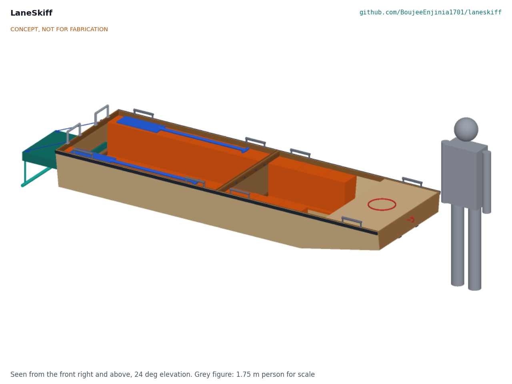
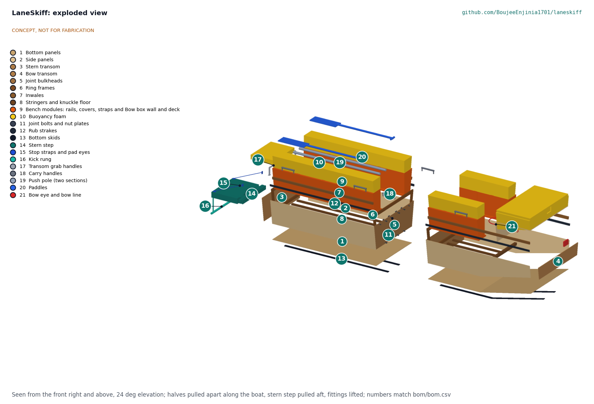
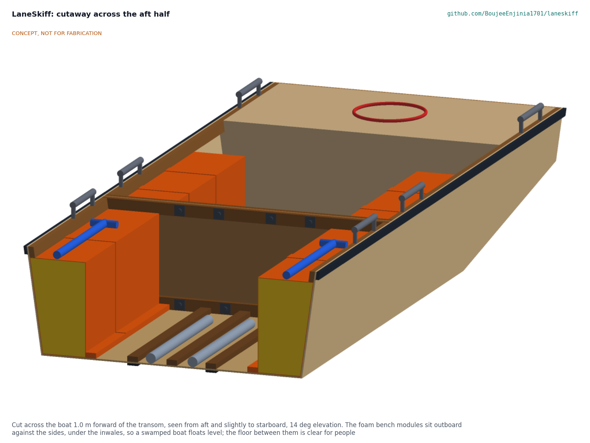

# LaneSkiff design precis

A flat-bottomed flood rescue boat two people carry into flooded lanes, with a floating stern step so people can climb in from waist-deep water.

*Figure 1. LaneSkiff assembled, stern step deployed, with a 1.75 m person for scale. CONCEPT, NOT FOR FABRICATION.*

## How it works

LaneSkiff is a punt-form skiff 3.6 m long and 1.137 m wide over its rub strakes, 0.40 m deep, built in two rigid halves of 1.8 m. Each half is a closed plywood box with its own end panel and its own joint bulkhead, so each half floats on its own and the joint between them carries load but needs no seal. Eight M10 bolts join the halves through hardwood ring frames on the two bulkheads; one spanner does it, because the nuts are welded to plates on the aft frame.

The bottom is flat for 2.7 m and rakes up to 200 mm at the bow, so the boat rides over kerbs and debris and can be poled in shallow water. The sides are flat plywood panels leaning out 8 degrees, which gives a wide waterline for stability and a narrow enough beam for lanes.

Buoyancy follows the LevelHull layout: closed-cell foam modules run along both sides under the inwales, and a foam-filled bow box sits under a short bow deck. When the boat is swamped, the foam is outboard and high enough that the boat floats nearly level with its rated persons aboard.

At the stern centre, a buoyant step float lies on the water behind the transom, hinged to a hardwood rail. A kick rung hangs 270 mm below it on webbing. A person in waist-deep water puts a foot on the rung, takes the two transom grab handles, kneels on the float and rolls over the transom. Boarding over the end of the boat heels it about 4 degrees, against about 16 degrees for the same person climbing over the side. Stop straps hold the float at 20 degrees below level, and a 40 mm gap between float and rail keeps fingers and feet clear through its whole swing.

The crew poles the boat with a two-section push pole or paddles it. Eight carry handles, two at each end of each half, and two padded shoulder slings let people carry each half into a lane and join the halves at the water.

## Components

*Table 1. Components (BOM line numbers from `bom/bom.csv`).*

| BOM | Component | Role |
| --- | --- | --- |
| 1 | Bottom panels, 6 mm plywood (aft, forward flat, bow rake) | Flat bottom with a knuckle and bow rake; glass outside |
| 2 | Side panels, 6 mm plywood (4) | Flat sides flared 8 deg; full length of each half |
| 3, 4 | Stern transom (9 mm) and bow transom (9 mm) | Close the ends; the stern transom carries the step and grab handles |
| 5 | Joint bulkheads, 6 mm plywood (2) | Close each half at the joint so each half floats alone |
| 6 | Ring frames, hardwood 20 x 45 (3) | Stiffen the transom and the bulkheads and take the joint bolts |
| 7 | Inwales, hardwood 20 x 40 (4) | Stiffen the sheer; hold handles, strakes and the bench modules |
| 8 | Stringers (6) and knuckle floor | Stiffen the floor; take the skid screws; join the bottom at the knuckle |
| 9 | Bench modules and bow box | Foam in sewn tarpaulin covers, strapped to bench rails; bow box wall and deck |
| 10 | Buoyancy foam, closed-cell polyethylene | 0.49 m3 in the hull plus the step float core (LevelHull layout) |
| 11 | Joint bolts M10 x 80 with nut plates (8), alignment pins (2) | Join the halves with one spanner |
| 12, 13 | Rub strakes and bottom skids, HDPE | Protect the hull from walls, kerbs and debris |
| 14 | Stern step: hinge rail, backing block, float, strap hinges | Boarding platform on the water behind the transom |
| 15, 16 | Stop straps and pad eyes; kick rung on straps | Hold the step at 20 deg below level; first foothold below the float |
| 17, 18 | Transom grab handles (2) and carry handles (8) | Handholds for boarding; carrying each half or the whole boat |
| 19, 20, 21 | Push pole (two 1.5 m sections), paddles (2), bow eye and 10 m bow line | Propulsion and control in lanes; towing and holding at a doorway |
| 22 to 28 | Epoxy, glass, consumables, topcoat, screws, shoulder slings | Build materials and carrying slings |

The optional fixed, forward-only fin drive is not part of the first prototype design; whether and how to add it is an open decision for Amish (LSK-DEC-001). The material substitution table is in the first-order numbers below.

*Figure 2. Exploded view: halves pulled apart along the boat, stern step pulled aft, fittings lifted. Numbers match the BOM.*

## Key design choices

Decided under Amish's pre-approval of 2026-10-03 (LSK-DDR-001 and LSK-DDR-002):

- **Punt form, constant width.** A flat bottom 1.0 m wide at the chine for 2.7 m, raked to the bow, with flat flared sides: the widest waterline and lowest draft for a lane-width beam, from flat panels a local yard can cut.
- **Two closed halves.** Each half has its own bulkhead, so the joint needs no seal and a half that is holed or loose still floats. The halves are bolted, not hinged or folded (the Porta-Bote design-around).
- **Plywood and epoxy first.** Stitch-and-glue is the most widely known small-boat method in coastal India and Bangladesh; aluminium and HDPE sheet paths are documented at concept level.
- **LevelHull buoyancy layout.** Foam outboard along the sides and forward, never low on the floor; no lift is credited to the plywood or timber.
- **Stern-centre boarding.** A float on the water and a kick rung below it, with transom handholds, after the expired US6932020B2 boarding platform.
- **Conservative safety choices.** Persons count at two thirds of their weight when swamped; the float swing is checked for pinch points; the step is proof-loaded before any boarding trial.

*Figure 3. Cutaway across the aft half: the foam bench modules sit against the sides under the inwales; the floor between them is clear.*

## First-order numbers

From LSK-CAL-001 (`docs/04-calcs/01-sizing.md`); assumptions are stated there.

*Table 2. First-order numbers, plywood and epoxy path.*

| Quantity | Value |
| --- | --- |
| Length, beam over strakes, depth | 3.60 m, 1.137 m, 0.40 m |
| Hull mass as carried (pole, paddles and line not counted) | 100 kg; aft half 56 kg, forward half 45 kg |
| Rated load assessed | Six persons, 450 kg (4.5 times hull mass) |
| Draft at rated load | 175 mm even keel; 162 mm at the transom, 187 mm at the forward end of the waterline |
| Draft with a crew of two | 87 mm |
| Heel boarding over the stern step; over the side | 4.3 deg; 15.6 deg |
| Swamped with rated persons | Afloat, trim 2.1 deg stern down, freeboard 36 mm at the transom and 164 mm at the bow |
| Joining the halves | About 6 min, one 17 mm spanner (estimate) |
| Estimated cost of the constructable design | USD 1,922 against a value-engineering target of USD 1,500 (USD 422 over the target) |

*Table 3. Material substitution table (hull mass and load carried at 150 mm draft, same hull form).*

| Build path | Hull mass | Load at 150 mm draft | Load over hull mass |
| --- | --- | --- | --- |
| Plywood and epoxy (prototype) | 100 kg | 361 kg | 3.6 |
| Aluminium 5052 sheet, 2.0 to 2.5 mm, welded or riveted | 98 kg | 364 kg | 3.7 |
| HDPE or polypropylene sheet, 5 to 8 mm, plastic welded | 110 kg | 352 kg | 3.2 |

The aluminium and plastic rows are screening estimates from panel areas; the framing, foam and fittings are the same as the plywood boat.

## Patent design-arounds

From the preliminary patent, trademark and prior-art screen (not legal advice):

- Single flat hull, poled or paddled; no twin pontoons with a jet ski transom and hinged ramp (US7832348B2, Newcomb, to 2028-10-24).
- Two rigid halves that bolt together; no flexible panel hull with a folding transom (US9061734B2, Porta-Bote, to 2029-12-30).
- Fin drive, if ever added, fixed and forward-only, following the expired US6022249 form; no rotating or 360 degree drive (US10259553B2 MirageDrive 360, to 2037-08-22).
- No reverse mechanism in any fin drive (Hobie US9359052 and US9981726, status unverified); never use MirageDrive or Hobie marks.
- Builds on lapsed prior art: US6932020B2 and US7011036B1 boarding platforms; EP0631552B1 and US7854211B2 nesting hulls.

## Shared blocks

- LevelHull (level-when-swamped buoyancy layout): foam modules outboard and high, in sewn covers.
- CalRig proof-load: the step hinge, stop straps, carry handles and bow eye are proof-loaded before trials.

## Safety

> **Safety:** LaneSkiff is published as an open engineering reference, not a certified rescue boat. Rescue in floodwater is hazardous: people can be swept off their feet, trapped under debris, cut, shocked by live wires or made ill by contaminated water.
>
> - Crew and passengers wear life jackets at all times; crews need water rescue training under their own agency's rules.
> - Not for swiftwater, surf, open water or water flowing faster than a person can wade against.
> - Do not exceed the rated load for the build material; the rating of the first prototype is still to be decided, and the payload differs between build paths.
> - Watch for submerged hazards, open drains, live electrical wires and contaminated water.
> - The boarding step has a hinge and a swinging float: the 40 mm gap keeps fingers and feet clear through its 20 degree swing, and nobody holds the hinge edge while the step is folded or unfolded.
> - When swamped, people stay seated and low; two people moving to one side can dip the gunwale (LSK-CAL-001, section 4).
> - The step, stop straps, handles and bow eye are proof-loaded to twice their working load before any boarding trial, and the first swamp test is run in calm, shallow water with a safety boat (LSK-BLD-001, safety stops).

## Open questions

Open decisions and items to confirm are kept in the design decisions register, `docs/06-design-decisions.md` (LSK-DEC-001).
